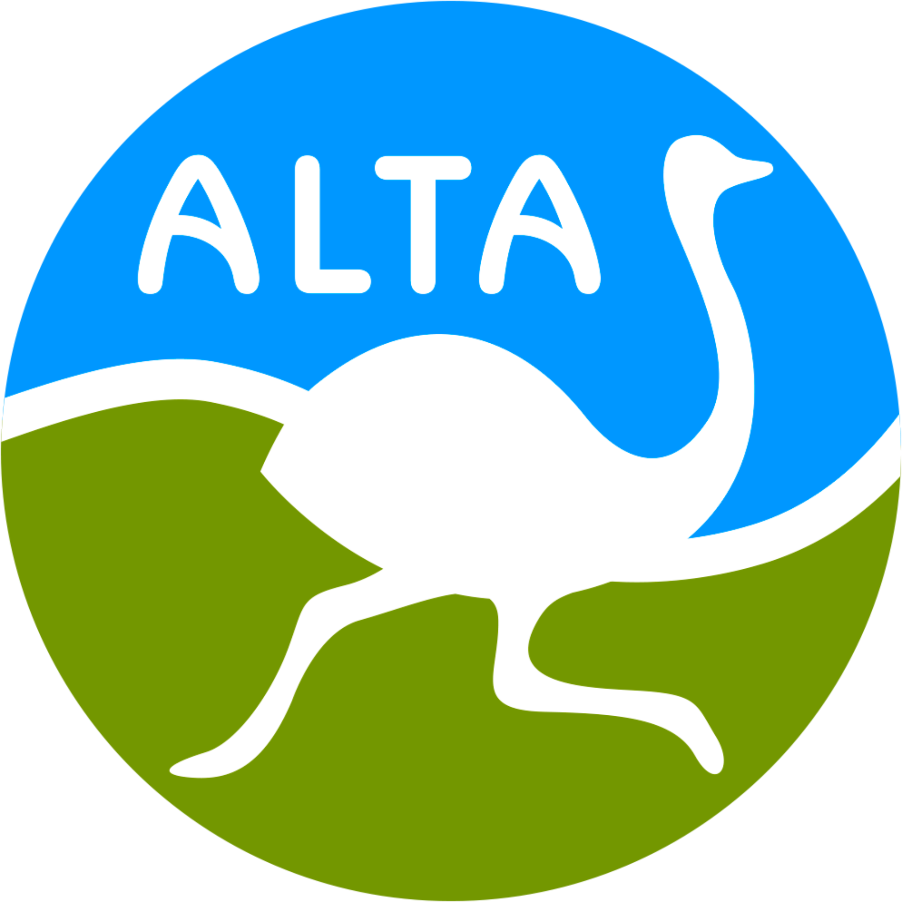

````markdown
# Alimentos Tropicales Argentinos | ALTA SA

<p align="center">
  
</p>

## 📋 Descripción del Proyecto

Esta es la plataforma web oficial de **Alimentos Tropicales Argentinos (ALTA SA)**, dedicada al procesamiento y exportación de oleaginosas y legumbres con los más altos estándares de calidad e inocuidad. La web permite a los usuarios conocer el catálogo de productos, los procesos de calidad y realizar solicitudes formales de carga y descarga de manera segura.

---

## 🚀 Tecnologías Utilizadas

- **Frontend:** Next.js 15 (React 18), TypeScript.
- **Estilos:** Tailwind CSS para un diseño responsivo y moderno.
- **Backend/Base de Datos:** Firebase (Firestore para registros y Storage para documentos PDF).
- **Seguridad:** Cloudflare Turnstile para protección contra bots y ataques.
- **Generación de Documentos:** `html2pdf.js` para la creación dinámica de órdenes de carga en formato PDF.
- **Iconografía:** Lucide React.

---

## 🛠️ Instalación y Ejecución Local

Sigue estos pasos para poner en marcha el proyecto en tu entorno local:

1. **Clonar el repositorio:**
   ```bash
   git clone [URL-DEL-REPOSITORIO]
   cd alta-sa-landing
   ```
````

2. **Instalar dependencias:**

   ```bash
   npm install
   ```

3. **Configurar variables de entorno:**
   Crea un archivo `.env.local` en la raíz del proyecto y añade tus credenciales (puedes basarte en `.env.example` si existe):

   ```env
   # Cloudflare Turnstile
   NEXT_PUBLIC_TURNSTILE_SITE_KEY=tu_site_key_aqui
   TURNSTILE_SECRET_KEY=tu_secret_key_aqui

   # Firebase Configuration
   NEXT_PUBLIC_FIREBASE_API_KEY=...
   NEXT_PUBLIC_FIREBASE_AUTH_DOMAIN=...
   NEXT_PUBLIC_FIREBASE_PROJECT_ID=...
   # ... resto de la config de Firebase
   ```

4. **Ejecutar el servidor de desarrollo:**
   ```bash
   npm run dev
   ```
   La aplicación estará disponible en `http://localhost:3000`.

---

## ⚠️ Requisitos Críticos de Seguridad (Cloudflare)

**¡IMPORTANTE!** Para garantizar la integridad del sistema, este proyecto implementa **Cloudflare Turnstile**.

Si no se vincula una clave válida de Cloudflare en las variables de entorno:

- **Secciones de Solicitudes:** Los botones de "Solicitar Carga" y "Solicitar Descarga" no podrán completar la verificación.
- **Envío de Emails:** El endpoint `/api/enviar-email` rechazará las peticiones al no poder validar el token de seguridad.
- **Base de Datos:** No se registrarán nuevas órdenes en Firestore ni se subirán archivos al Storage, ya que la validación de seguridad es el primer paso de cada transacción.

Asegúrate de que el dominio (incluyendo `localhost` para desarrollo) esté autorizado en tu panel de Cloudflare.

---

## 📂 Estructura del Proyecto

- `/app`: Rutas de la aplicación y endpoints de la API.
- `/components`: Componentes de UI (Radix/Shadcn) y secciones de la landing.
- `/lib`: Configuración de Firebase y utilidades.
- `/public`: Activos estáticos, imágenes de productos y el logo de la empresa.

---

## ✉️ Contacto

**ALTA SA** - Embarcación, Salta, Argentina.
[site](https://alimentostropicales.com)

```

```
